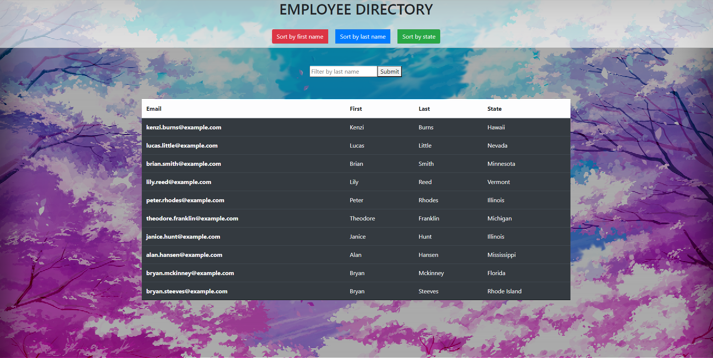

# Employee-Directory

## Description
This app was built using react as the front end framework to showcase the use of react components and file structure. The main features of the app use buttons and an input field from bootstrap to sort and filter data from an axios call from the random user generator api found here:  https://randomuser.me/ .

## Table of Contents
* [Usage](#Usage)
* [Demonstration](#Demonstration)
* [License](#License)
* [Questions](#Questions)

## Usage
To use this react app simply follow the link below to the website hosted on github pages. Once on the page you will see a list of employee's that can be sorted by the various buttons or filtered by last name using the input field.

### Deployed application link - https://patrick-kaczmar.github.io/Employee-Directory/

## Demonstration

## License
MIT License - Copyright 2021 Patrick-Kaczmar

    Permission is hereby granted, free of charge, to any person obtaining a copy of this software and associated documentation files (the "Software"), to deal in the Software without restriction, including without limitation the rights to use, copy, modify, merge, publish, distribute, sublicense, and/or sell copies of the Software, and to permit persons to whom the Software is furnished to do so, subject to the following conditions:
    
    The above copyright notice and this permission notice shall be included in all copies or substantial portions of the Software.
    
    THE SOFTWARE IS PROVIDED "AS IS", WITHOUT WARRANTY OF ANY KIND, EXPRESS OR IMPLIED, INCLUDING BUT NOT LIMITED TO THE WARRANTIES OF MERCHANTABILITY, FITNESS FOR A PARTICULAR PURPOSE AND NONINFRINGEMENT. IN NO EVENT SHALL THE AUTHORS OR COPYRIGHT HOLDERS BE LIABLE FOR ANY CLAIM, DAMAGES OR OTHER LIABILITY, WHETHER IN AN ACTION OF CONTRACT, TORT OR OTHERWISE, ARISING FROM, OUT OF OR IN CONNECTION WITH THE SOFTWARE OR THE USE OR OTHER DEALINGS IN THE SOFTWARE.

## Questions
Patrick-Kaczmar's GitHub profile - https://github.com/Patrick-Kaczmar

If there are any additional questions about this repository please contact me at pk1blue@yahoo.com
